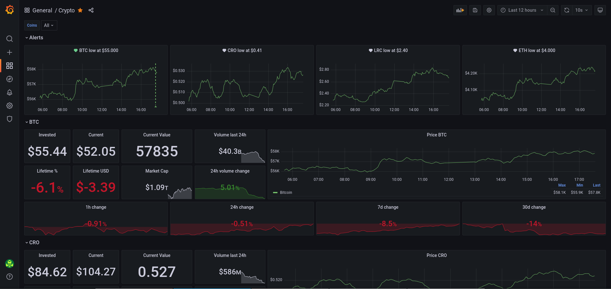

# crypto2influx

## tl;dr

Fetch data from [coinmarketcap.com](https://coinmarketcap.com) and write it to influxdb.
The data can then be querried from grafana for custom coin dashboards

## Current state

Right now this is not much more than a poc to connect all the dots in go code

## How to run

```
> o run . -vvv --coinmarketcap-token=<token> --influx-token="<token>" --influx-org="<org_name>" --influx-bucket="<bucket>" -c bitcoin:61600.000:0.0009 -c ethereum:4849.13793:0.00557 -c crypto-com-coin:0.42737:198.0 -c loopring:2.73133:30 -c enjin-coin:3.32220:9.03016 -c curecoin:0.0:24.869269
9:21PM INF  lastUpdate=2021-11-17T20:21:02Z name=Bitcoin price=60136.113124675714
9:21PM INF  lastUpdate=2021-11-17T20:21:05Z name=Curecoin price=0.08947823170101954
9:21PM INF  lastUpdate=2021-11-17T20:21:02Z name=Ethereum price=4222.4588941124075
9:21PM INF  lastUpdate=2021-11-17T20:20:09Z name=Loopring price=2.5049635560118797
9:21PM INF  lastUpdate=2021-11-17T20:21:03Z name="Enjin Coin" price=2.903175277585872
9:21PM INF  lastUpdate=2021-11-17T20:21:06Z name="Crypto.com Coin" price=0.5434956410936232
```

## Visualisation



[Grafana dashboard model](/grafana/dashboard.json)
